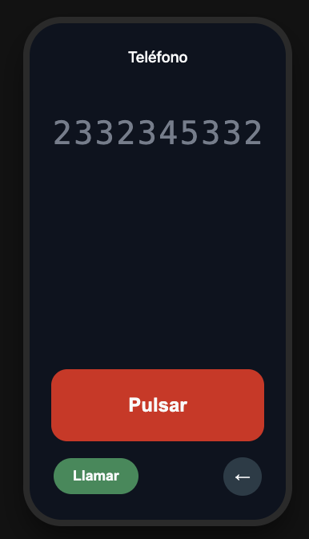

# Prompts — TP 1

## 1 - Prompt inicial

Construí una pantalla de llamada de teléfono con un marcador de un solo botón.

Estructura:

- <header> con el título "Teléfono" y un  vacío.
- <main> con un <output id="display"> que muestra los dígitos ingresados (10 casilleros), y debajo un único <button id="dial"> rojo y grande.
- <footer> con un <button id="call"> "Llamar", deshabilitado hasta tener 10 dígitos, y un <button id="del"> chiquito con "←".

Estilo:

- Imitación de teléfono: marco angosto redondeado centrado, fondo #0e131f, texto #f9fafb, el botón rojo #d42222 ocupando casi todo el ancho.
- Display en monoespaciada 2.5rem: los dígitos ya confirmados en gris #757d8c, el que estoy editando en blanco.

Comportamiento:

- Estado `digitos` (array de números, máximo 10), estado `actual` (número 0-9, inicial 0), estado `llamando` (booleano).
- Click corto en #dial: incrementar `actual` en 1. Al pasar de 9 vuelve a 0.
- Mantener #dial apretado 1 segundo: confirmar `actual`, agregarlo a
  `digitos` y volver `actual` a 0. Si ya hay 10 dígitos, no hace nada.
- Click en #del: borrar el último dígito de `digitos`. `actual` vuelve a 0.
- Click en #call con 10 dígitos: `llamando = true`, el display se reemplaza por "Llamando..." y el botón rojo pasa a decir "Colgar".

Constraints: un solo archivo HTML, vanilla JS, sin dependencias externas.

No asumas nada, hace las preguntas que necesites.

**Qué intentaba lograr:** Plasmar una versión inicial de la idea que sea funcional

**Qué devolvió:** A pesar de que no me hizo preguntas, devolvió la versión esperada, en un solo archivo como fue solicitado.

**Qué hice con eso:** lo acepté, pero decidí seguir iterando para incorporar mejoras.
